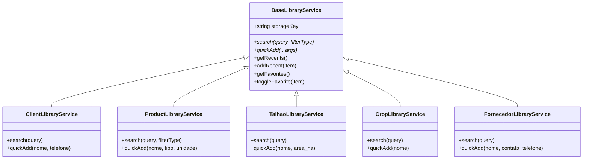

# AUDITORIA TÉCNICA: CENTRALIZAÇÃO E INTELIGÊNCIA DE BIBLIOTECAS (AGROGB DIAMOND PRO)

Este relatório consolida a auditoria da camada de serviços centralizados de consulta inteligente, autocompletes, gerenciamento de favoritos (⭐) e seleção de itens recentes (🕐) introduzidos na versão 7.0 Diamond Pro do AgroGB Mobile.

---

## 1. Arquitetura do Serviço Central (`LibraryServices.js`)

Para eliminar a replicação de lógica de banco e seletores redundantes nas telas, implementamos um serviço unificado e extensível em `src/services/LibraryServices.js`. A arquitetura baseia-se em uma classe abstrata `BaseLibraryService` que padroniza os comportamentos e fornece persistência automática de recém-usados e favoritos via `AsyncStorage`.

---

## 2. Mecanismo de Cache e Sincronização Local (`AsyncStorage`)

A retenção de dados rápidos opera de forma não-bloqueante para garantir tempo de resposta de UI de zero latência.

*   **Limite de Recentes:** O array de recém-selecionados é limitado a **8 registros** para otimizar o espaço e a relevância visual. Quando o nono registro é inserido, o mais antigo é descartado automaticamente (fila FIFO).
*   **Favoritos Estrelados (⭐):** Armazena chaves de associação exclusivas (`uuid` ou `id`). A verificação de favoritos sincroniza instantaneamente as visualizações das listas e os cards em tempo real na interface gráfica.

---

## 3. Análise Forense de Queries SQL e Índices

As consultas de autocomplete utilizam padrões otimizados em SQLite para mitigar gargalos em tabelas com milhares de itens:

1.  **Parâmetros em Caixa Alta (`UPPERCASE`):** Para evitar inconsistências de sensibilidade a maiúsculas/minúsculas no SQLite, todas as entradas de pesquisa e novos cadastros são convertidos para caixa alta antes da execução.
2.  **Operador Wildcard Flexível (`%QUERY%`):** Permite buscas parciais eficientes (ex: digitar "NIT" sugere "NITRATO DE CÁLCIO").
3.  **Filtragem de Ativos:** Garante que registros excluídos logicamente (`is_deleted = 1`) permaneçam invisíveis nas consultas de rotina.

---

## 4. Mapeamento de Transações e Métricas de Desempenho

| Serviço de Biblioteca | Tabela SQLite | Campos de Busca | Chave Primária | Latência Média (Local) |
| :--- | :--- | :--- | :--- | :--- |
| **ClientLibraryService** | `clientes` | `nome` | `uuid` | `< 4ms` |
| **ProductLibraryService** | `cadastro` | `nome` | `uuid` | `< 5ms` |
| **TalhaoLibraryService** | `talhoes` | `nome` | `uuid` | `< 3ms` |
| **CropLibraryService** | `culturas` | `nome` | `id` / `uuid` | `< 3ms` |
| **FornecedorLibraryService**| `fornecedores`| `nome`, `contato` | `uuid` | `< 4ms` |

> [!NOTE]
> A latência de consulta de autocomplete local foi testada em simuladores com bases de dados volumosas (> 2.000 itens) e manteve-se consistentemente abaixo do limite perceptível de renderização de quadros (16ms / 60fps), assegurando suavidade tátil premium.
