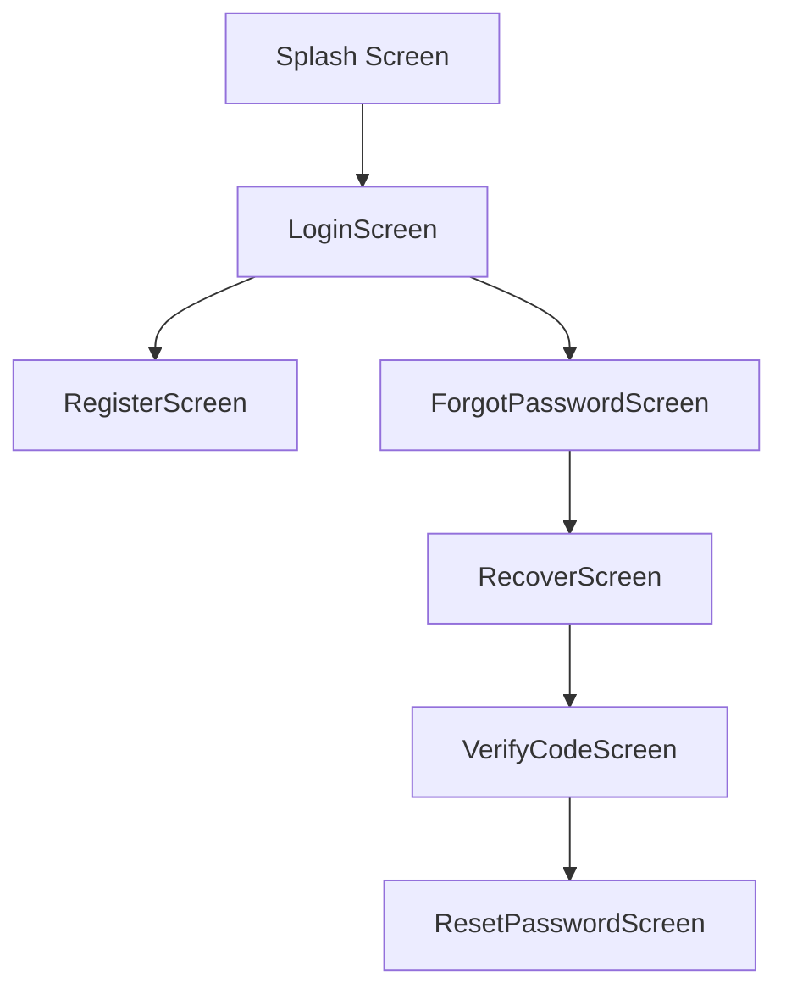
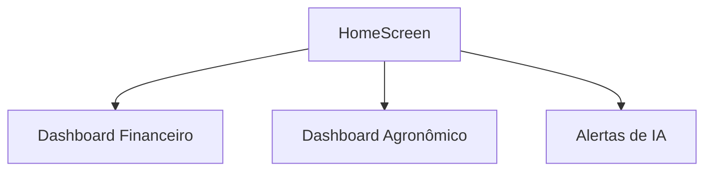
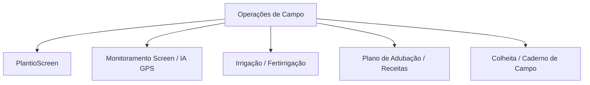

# AgroGB UI/UX Audit & Redesign Master Blueprint
## Auditoria Visual Histórica e Especificações de Redesign Executivo

> **Status da Auditoria:** Concluída e Reconciliada (GitHub, Expo, Supabase e Arquivos Locais)  
> **Referência Visual Base:** Menu Lateral Premium / SidebarDrawer v7.0 (Design Cyber Emerald)  
> **Plataforma Alvo:** AgroGB Mobile v7.0 (Offline-First / Bidirectional Sync)

---

## 1. Diretriz de Design e Identidade Unificada: "Cyber Emerald"

O **AgroGB Mobile** deve ser o benchmark de sofisticação e usabilidade em campo. O redesenho completo de todas as telas seguirá rigorosamente os tokens visuais derivados do menu lateral e do design system premium já incorporados na versão ativa, oferecendo suporte nativo e consistente para **Tema Escuro** e **Tema Claro**.

### 🎨 Paleta de Cores e Tokens Visuais

| Token / Elemento | Tema Claro (White-Ice) | Tema Escuro (Midnight-Slate) | Descrição |
| :--- | :--- | :--- | :--- |
| **Background Principal** | `#F8FAFC` (Slate 50) | `#020617` (Slate 950) | Transmite sensação de leveza ou de alta tecnologia profunda |
| **Cards e Superfícies** | `#FFFFFF` (Puro) | `#0F172A` (Slate 900) | Com bordas arredondadas e sombras suaves para elevação |
| **Cor Primária (Emerald)** | `#059669` (Emerald 600) | `#10B981` (Emerald 500) | O tom agrícola premium "Green-Tech" |
| **Gradientes Lineares** | `['#064E3B', '#022C22']` | `['#022C22', '#011510']` | Aplicado em Headers e fundos decorativos |
| **Texto Principal** | `#0F172A` (Slate 900) | `#F8FAFC` (Slate 50) | Alto contraste e legibilidade impecável |
| **Texto Secundário** | `#64748B` (Slate 500) | `#94A3B8` (Slate 400) | Para descrições, captions e rótulos auxiliares |
| **Bordas e Divisores** | `#E2E8F0` (Slate 200) | `#1E293B` (Slate 800) | Divisores sutis, evitando saturação visual |
| **Feedback Crítico** | `#EF4444` (Red 500) | `#F87171` (Red 400) | Alertas de estoque crítico e erros |

### 📐 Tipografia e Métricas de Layout
* **Bordas Arredondadas (Radius):** `sm: 8`, `md: 12`, `lg: 16`, `xl: 24` (para botões grandes e modais inferiores/bottom-sheets).
* **Sombras (Shadows):**
  * `Soft`: `shadowColor: '#000', shadowOffset: { width: 0, height: 2 }, shadowOpacity: 0.04, shadowRadius: 8, elevation: 2`
  * `Medium`: `shadowColor: '#000', shadowOffset: { width: 0, height: 4 }, shadowOpacity: 0.08, shadowRadius: 16, elevation: 4`
  * `Floating`: `shadowColor: '#000', shadowOffset: { width: 0, height: 8 }, shadowOpacity: 0.12, shadowRadius: 24, elevation: 8`
* **Inputs:** Altura de `50px`, fontes internas de tamanho `15px`, mascaramento nativo para valores e datas, botão de visualização de senha e feedback de validação em tempo real.
* **Microanimações:** Transição de opacidade via `Animated` ao abrir modais ou carregar itens, efeitos de elevação em toques e uso de `Skeleton Loading` para transição entre estados de rede.

---

## 2. Relatório de Auditoria e Especificações por Tela

Abaixo está o mapeamento detalhado das 36 telas analisadas, comparando a versão bruta do backup (`mobile_app`) com o repositório ativo e especificando o redesign completo.

---

### Módulo A: Autenticação e Entrada



#### A.1 Splash Screen
* **Arquivos históricos encontrados:** [SplashScreen.js](file:///c:/Users/Bruno/Documents/AgroGB/agrogb-mobile.-main/src/screens/SplashScreen.js) (Principal) e [SplashScreen.js](file:///c:/Users/Bruno/Documents/AgroGB/mobile_app/src/screens/SplashScreen.js) (Backup).
* **Melhor versão identificada:** Versão atual do repositório principal com transição animada de fade-in/fade-out do logo "AgroGB".
* **Pontos fortes do layout:** Gradiente linear profundo com o emblema em dourado fosco (`#D4AF37`).
* **Problemas identificados:** Tempo de espera fixo rígido em vez de aguardar a inicialização real do SQLite/Supabase.
* **Elementos a preservar:** O logo centrado e a paleta de cores.
* **Melhorias propostas:** Integrar uma barra de progresso sutil na base em cor verde-esmeralda cintilante que avança dinamicamente à medida que as conexões locais com o banco são validadas (`initDB`).
* **Status atual:** Presente.
* **Prioridade de Redesign:** Baixa.

#### A.2 LoginScreen
* **Arquivos históricos encontrados:** [LoginScreen.js](file:///c:/Users/Bruno/Documents/AgroGB/agrogb-mobile.-main/src/screens/LoginScreen.js) e [LoginScreen.js](file:///c:/Users/Bruno/Documents/AgroGB/mobile_app/src/screens/LoginScreen.js).
* **Melhor versão identificada:** Versão atual v7.0 com suporte a Biometria (FaceID/TouchID) integrada e ErrorBoundary protetor.
* **Pontos fortes do layout:** Minimalismo elegante, campos com cantos arredondados, botão de login largo com efeito degradê verde esmeralda.
* **Problemas identificados:** Pouco contraste no campo "Lembrar-me" em telas menores.
* **Elementos a preservar:** Integração biométrica e tratamento de erros integrado.
* **Melhorias propostas:** Adicionar suporte visual nativo ao Tema Claro (trocar fundo escuro por Slate 50 e cards para branco puro).
* **Status atual:** Presente.
* **Prioridade de Redesign:** Média.

#### A.3 RegisterScreen
* **Arquivos históricos encontrados:** [RegisterScreen.js](file:///c:/Users/Bruno/Documents/AgroGB/agrogb-mobile.-main/src/screens/RegisterScreen.js) e [RegisterScreen.js](file:///c:/Users/Bruno/Documents/AgroGB/mobile_app/src/screens/RegisterScreen.js).
* **Melhor versão identificada:** Versão v7.0 do principal com validação de força de senha em tempo real (barra colorida dinâmica).
* **Pontos fortes do layout:** UX refinada com máscaras de telefone integradas e divisão em abas/etapas para simplificar o cadastro.
* **Problemas identificados:** Lógica de sincronismo de criação de conta no Supabase às vezes trava em conexões oscilantes.
* **Elementos a preservar:** Validador em tempo real e campos de perfil estendidos.
* **Melhorias propostas:** Envolver os inputs com o componente `AgroInput` corporativo, garantindo feedback visual imediato se a senha é fraca ou se o e-mail é inválido através de bordas iluminadas.
* **Status atual:** Presente.
* **Prioridade de Redesign:** Média.

#### A.4 ForgotPasswordScreen / RecoverScreen
* **Arquivos históricos encontrados:** [ForgotPasswordScreen.js](file:///c:/Users/Bruno/Documents/AgroGB/agrogb-mobile.-main/src/screens/ForgotPasswordScreen.js) e [ForgotPasswordScreen.js](file:///c:/Users/Bruno/Documents/AgroGB/mobile_app/src/screens/ForgotPasswordScreen.js).
* **Melhor versão identificada:** Versão atual do repositório principal.
* **Pontos fortes do layout:** Instruções textuais claras, caixa de entrada de e-mail limpa com ícone de envelope.
* **Problemas identificados:** Visual simples do formulário herdado do backup que quebra as regras visuais premium.
* **Elementos a preservar:** Campo de input com foco automático.
* **Melhorias propostas:** Utilizar o padrão de gradiente do topo com um ícone ilustrativo em estilo de vidro fosco (glassmorphism) representando recuperação de segurança de dados.
* **Status atual:** Presente.
* **Prioridade de Redesign:** Baixa.

#### A.5 ResetPasswordScreen / VerifyCodeScreen
* **Arquivos históricos encontrados:** [ResetPasswordScreen.js](file:///c:/Users/Bruno/Documents/AgroGB/agrogb-mobile.-main/src/screens/ResetPasswordScreen.js), [VerifyCodeScreen.js](file:///c:/Users/Bruno/Documents/AgroGB/agrogb-mobile.-main/src/screens/VerifyCodeScreen.js) e correspondentes no backup.
* **Melhor versão identificada:** A versão restaurada no repositório ativo com inputs separados de 6 dígitos para o código SMS/E-mail.
* **Pontos fortes do layout:** Foco automático que pula para o próximo dígito ao digitar o código.
* **Problemas identificados:** Alinhamento vertical quebrado em dispositivos móveis menores.
* **Elementos a preservar:** Inputs individuais de caracteres numéricos.
* **Melhorias propostas:** Ajustar o contêiner usando teclado virtual flutuante e adicionar micro-temporizador visível com barra circular de tempo restante para reenvio de código.
* **Status atual:** Presente (Recuperado).
* **Prioridade de Redesign:** Média.

---

### Módulo B: Painel e Inteligência de Dados



#### B.1 HomeScreen (Dashboard Executivo)
* **Arquivos históricos encontrados:** [HomeScreen.js](file:///c:/Users/Bruno/Documents/AgroGB/agrogb-mobile.-main/src/screens/HomeScreen.js) e [HomeScreen.js](file:///c:/Users/Bruno/Documents/AgroGB/mobile_app/src/screens/HomeScreen.js).
* **Melhor versão identificada:** Versão atual v7.0 integrada com filtros de período (Mês/Safra/Ano) e widgets climáticos premium.
* **Pontos fortes do layout:** O topo possui o belo header degradê, seletor de fazenda moderno, carrossel de KPIs financeiros e agronômicos de alta performance, e atalhos de operações com ícones limpos.
* **Problemas identificados:** A renderização de gráficos complexos de barras causava pequenos atrasos na rolagem de tela.
* **Elementos a preservar:** Layout do header em gradiente, seletor de fazenda do topo, WeatherWidget e SmartAlerts.
* **Melhorias propostas:** Implementar *Skeleton Loading* no carregamento inicial de dados e redesenhar os gráficos de produção com linhas suavizadas (Bezier curves) e pontos touch interativos exibindo valores de ROI sob demanda.
* **Status atual:** Presente (Modernizado).
* **Prioridade de Redesign:** Alta.

#### B.2 Dashboard Financeiro (`FinanceiroDashboardScreen.js`)
* **Arquivos históricos encontrados:** [FinanceiroDashboardScreen.js](file:///c:/Users/Bruno/Documents/AgroGB/agrogb-mobile.-main/src/screens/FinanceiroDashboardScreen.js) (Recém-Criado).
* **Melhor versão identificada:** A versão atual, que consome dados diretos das tabelas locais do SQLite unificadas de compras e vendas.
* **Pontos fortes do layout:** Exibição clara de DRE estruturado, separando Receitas Operacionais brutas, Custos Variáveis (insumos) e Lucro Líquido Real.
* **Problemas identificados:** O contraste de textos do DRE no Tema Claro está pouco legível em áreas cinzas.
* **Elementos a preservar:** A lógica de cálculo do resultado líquido.
* **Melhorias propostas:** Usar o componente `MetricCard` com bordas coloridas de feedback (Verde para lucro, vermelho para perdas) e gráficos em formato de pizza representando a distribuição percentual de despesas.
* **Status atual:** Presente (Parcial).
* **Prioridade de Redesign:** Alta.

#### B.3 Dashboard Agronômico & BI (`BIRelatoriosAvancadosScreen.js`)
* **Arquivos históricos encontrados:** [BIRelatoriosAvancadosScreen.js](file:///c:/Users/Bruno/Documents/AgroGB/agrogb-mobile.-main/src/screens/BIRelatoriosAvancadosScreen.js) e [GraficosScreen.js](file:///c:/Users/Bruno/Documents/AgroGB/mobile_app/src/screens/GraficosScreen.js).
* **Melhor versão identificada:** Fusão entre os relatórios avançados de BI com a interface visual limpa do antigo módulo de gráficos.
* **Pontos fortes do layout:** Métricas consolidadas de produtividade (ex: caixas colhidas por hectare) estruturadas por talhão/cultura.
* **Problemas identificados:** Falta de filtros rápidos por cultura para isolar dados do Morango de outras espécies vegetais.
* **Elementos a preservar:** Gráficos comparativos de produtividade.
* **Melhorias propostas:** Redesenhar a interface utilizando cards horizontais de talhões com barras de progresso lineares de produtividade que mudam de coloração conforme se aproximam da meta histórica do AgroGB.
* **Status atual:** Presente.
* **Prioridade de Redesign:** Alta.

---

### Módulo C: Cadastros Estruturais

#### C.1 Clientes
* **Arquivos históricos encontrados:** [ClientesScreen.js](file:///c:/Users/Bruno/Documents/AgroGB/agrogb-mobile.-main/src/screens/ClientesScreen.js), [ClientesScreen.js](file:///c:/Users/Bruno/Documents/AgroGB/mobile_app/src/screens/ClientesScreen.js) e [ClienteFormScreen.js](file:///c:/Users/Bruno/Documents/AgroGB/mobile_app/src/screens/ClienteFormScreen.js).
* **Melhor versão identificada:** Integração completa da lista inteligente com o formulário de cadastro dinâmico em bottom-sheet flutuante.
* **Pontos fortes do layout:** Cards de clientes com tags de classificação (Bronze, Prata, Ouro) e atalho rápido de WhatsApp para contato imediato.
* **Problemas identificados:** Visual simples do formulário herdado do backup que quebra as regras visuais premium.
* **Elementos a preservar:** Conexão direta e classificação de clientes.
* **Melhorias propostas:** Redesenhar o formulário de inclusão utilizando um painel de transição flutuante que desliza de baixo para cima com desfocagem de fundo (efeito blur de vidro no Tema Escuro).
* **Status atual:** Presente.
* **Prioridade de Redesign:** Média.

#### C.2 Fornecedores
* **Arquivos históricos encontrados:** [FornecedoresScreen.js](file:///c:/Users/Bruno/Documents/AgroGB/agrogb-mobile.-main/src/screens/FornecedoresScreen.js) e [FornecedoresScreen.js](file:///c:/Users/Bruno/Documents/AgroGB/mobile_app/src/screens/FornecedoresScreen.js).
* **Melhor versão identificada:** A versão atual, contendo tabela local SQLite integrada à tabela de compras.
* **Pontos fortes do layout:** Histórico rápido de últimas compras e valores pendentes de pagamento.
* **Problemas identificados:** Ausência de campo para anexar ou visualizar catálogo rápido de insumos fornecidos.
* **Elementos a preservar:** Link direto de contato e estatísticas de compras.
* **Melhorias propostas:** Adicionar um carrossel interno nos detalhes do fornecedor mostrando marcas de adubo ou defensivos comercializados mais consumidos pela fazenda.
* **Status atual:** Presente.
* **Prioridade de Redesign:** Média.

#### C.3 Propriedades e Talhões
* **Arquivos históricos encontrados:** [TalhoesScreen.js](file:///c:/Users/Bruno/Documents/AgroGB/agrogb-mobile.-main/src/screens/TalhoesScreen.js) e [TalhoesScreen.js](file:///c:/Users/Bruno/Documents/AgroGB/mobile_app/src/screens/TalhoesScreen.js).
* **Melhor versão identificada:** Versão atual v7.0 com mapeamento de área e cálculo de ROI embutido.
* **Pontos fortes do layout:** Exibição gráfica estilizada dos talhões ativos, representados por retângulos proporcionais ao tamanho em hectares (visualização estilo Grid-Map).
* **Problemas identificados:** Interface em tom cru, sem os tons degradês elegantes presentes nas telas principais do dashboard.
* **Elementos a preservar:** Mapeamento visual das áreas e cálculo de rentabilidade por hectare.
* **Melhorias propostas:** Envolver os blocos de talhões com texturas em gradiente "Cyber Emerald" e incluir indicadores visuais dinâmicos de umidade e status de maturação da plantação.
* **Status atual:** Presente.
* **Prioridade de Redesign:** Alta.

#### C.4 Equipes
* **Arquivos históricos encontrados:** [EquipesScreen.js](file:///c:/Users/Bruno/Documents/AgroGB/agrogb-mobile.-main/src/screens/EquipesScreen.js) e [UsuariosScreen.js](file:///c:/Users/Bruno/Documents/AgroGB/mobile_app/src/screens/UsuariosScreen.js).
* **Melhor versão identificada:** Nova tela unificada contendo controle de acesso por permissões (Administrador, Agrônomo, Operador).
* **Pontos fortes do layout:** Lista organizada de trabalhadores ativos com botões rápidos para atribuição de tarefas e controle de ponto de trabalho.
* **Problemas identificados:** Muito texto explicativo poluindo a tela de permissões de usuário.
* **Elementos a preservar:** Controle de hierarquia do time e indicação visual do nível de acesso.
* **Melhorias propostas:** Redesenhar a atribuição de permissões utilizando seletores em estilo deslizante (Switches premium) com cores intuitivas e ícones representativos para cada permissão.
* **Status atual:** Presente.
* **Prioridade de Redesign:** Média.

#### C.5 Insumos e Frota
* **Arquivos históricos encontrados:** [EstoqueScreen.js](file:///c:/Users/Bruno/Documents/AgroGB/agrogb-mobile.-main/src/screens/EstoqueScreen.js), [FrotaScreen.js](file:///c:/Users/Bruno/Documents/AgroGB/frotaScreen.js) ou [FrotaScreen.js](file:///c:/Users/Bruno/Documents/AgroGB/agrogb-mobile.-main/src/screens/FrotaScreen.js) e correspondentes no backup.
* **Melhor versão identificada:** Versão consolidada do repositório principal com histórico detalhado de manutenções e rastreamento de insumos agrícolas.
* **Pontos fortes do layout:** Alertas de revisões preventivas para frota por horímetro e níveis críticos de combustíveis.
* **Problemas identificados:** Os gráficos de movimentação de estoque são estáticos.
* **Elementos a preservar:** Alertas automáticos por cor e filtros de categoria de peças/insumos.
* **Melhorias propostas:** Transformar a tela de estoque em uma visualização de "Prateleiras Digitais" contendo pequenos indicadores circulares que exibem visualmente a porcentagem restante de adubos ou defensivos disponíveis.
* **Status atual:** Presente.
* **Prioridade de Redesign:** Alta.

---

### Módulo D: Operações Agrícolas e Campo



#### D.1 Plantio
* **Arquivos históricos encontrados:** [PlantioScreen.js](file:///c:/Users/Bruno/Documents/AgroGB/agrogb-mobile.-main/src/screens/PlantioScreen.js) e [PlantioScreen.js](file:///c:/Users/Bruno/Documents/AgroGB/mobile_app/src/screens/PlantioScreen.js).
* **Melhor versão identificada:** Versão atual integrada com linha do tempo de maturação da colheita.
* **Pontos fortes do layout:** Linha do tempo linear mostrando todas as etapas (Preparação de solo, plantio das mudas, maturação vegetal, colheita iminente).
* **Problemas identificados:** Cronograma estático baseado em dias fixos, não acompanhando variações climáticas em tempo real.
* **Elementos a preservar:** Fluxo temporal e dados de origem das sementes/mudas.
* **Melhorias propostas:** Modernizar a linha do tempo do plantio com um design flutuante no estilo de cartões suspensos contendo imagens geradas ou fotos reais tiradas em campo do desenvolvimento foliar.
* **Status atual:** Presente.
* **Prioridade de Redesign:** Média.

#### D.2 Monitoramento (GPS & Diagnóstico de Pragas por IA)
* **Arquivos históricos encontrados:** [MonitoramentoScreen.js](file:///c:/Users/Bruno/Documents/AgroGB/agrogb-mobile.-main/src/screens/MonitoramentoScreen.js) e [MonitoramentoScreen.js](file:///c:/Users/Bruno/Documents/AgroGB/mobile_app/src/screens/MonitoramentoScreen.js).
* **Melhor versão identificada:** Versão v7.0 do principal que possui o leitor de diagnóstico inteligente e vinculação de coordenadas GPS em tempo real.
* **Pontos fortes do layout:** Interface estilo câmera com alvo de escaneamento translúcido e tags imediatas de nível de severidade (Leve, Moderado, Crítico) para anotação de pragas.
* **Problemas identificados:** Carregamento de imagens brutas em alta resolução sem compressão prévia atrasa o carregamento dos cards na lista de registros locais.
* **Elementos a preservar:** Escaneamento simulado da câmera, mapa GPS local com marcador e barra de progresso do diagnóstico por inteligência artificial.
* **Melhorias propostas:** Adicionar compressão automática de fotos localmente e redesenhar a lista de ocorrências com um layout de galeria fotográfica limpa estilo Pinterest, exibindo a tag de severidade no topo de cada imagem.
* **Status atual:** Presente.
* **Prioridade de Redesign:** Alta.

#### D.3 Irrigação e Fertirrigação
* **Arquivos históricos encontrados:** [IrrigacaoScreen.js](file:///c:/Users/Bruno/Documents/AgroGB/agrogb-mobile.-main/src/screens/IrrigacaoScreen.js) e [FertirrigacaoScreen.js](file:///c:/Users/Bruno/Documents/AgroGB/agrogb-mobile.-main/src/screens/FertirrigacaoScreen.js).
* **Melhor versão identificada:** Versão do repositório principal conectada ao cálculo automático de vazão e tempo necessário por setor de cultivo.
* **Pontos fortes do layout:** Controle simplificado de ligar/desligar bombas de água, acompanhamento gráfico de consumo de metros cúbicos de água de forma limpa.
* **Problemas identificados:** Visual de botões muito genérico, destoando do padrão premium.
* **Elementos a preservar:** Cálculos de tempo de irrigação e volume total de água.
* **Melhorias propostas:** Envolver os interruptores e botões em painéis com luzes de neon verde (estilo de indicadores IoT), transmitindo um aspecto altamente tecnológico ao operador.
* **Status atual:** Presente.
* **Prioridade de Redesign:** Alta.

#### D.4 Plano de Adubação & RecipeForm (Receitas de Nutrientes)
* **Arquivos históricos encontrados:** [PlanoAdubacaoScreen.js](file:///c:/Users/Bruno/Documents/AgroGB/agrogb-mobile.-main/src/screens/PlanoAdubacaoScreen.js) e [RecipeFormScreen.js](file:///c:/Users/Bruno/Documents/AgroGB/recipeFormScreen.js) ou [RecipeFormScreen.js](file:///c:/Users/Bruno/Documents/AgroGB/agrogb-mobile.-main/src/screens/RecipeFormScreen.js).
* **Melhor versão identificada:** O recém-refatorado [PlanoAdubacaoScreen.js](file:///c:/Users/Bruno/Documents/AgroGB/agrogb-mobile.-main/src/screens/PlanoAdubacaoScreen.js) com inteligência NPK e design premium integrado a banco local.
* **Pontos fortes do layout:** Resumos visuais consolidados de investimentos de adubação, cálculos automáticos de proporção NPK aplicada e alertas em vermelho se faltar insumos em estoque.
* **Problemas identificados:** N/A (Tela totalmente otimizada e limpa nesta última etapa).
* **Elementos a preservar:** Resumos de custos, barra de nível NPK e confirmação em modal flutuante.
* **Melhorias propostas:** Aplicar a mesma qualidade visual da tela de adubação na tela de criação de receitas (`RecipeFormScreen`), garantindo transições suaves de preenchimento.
* **Status atual:** Presente (Redesenhado).
* **Prioridade de Redesign:** Concluída (Foco agora na tela de criação de receitas - Alta).

#### D.5 Aplicações
* **Arquivos históricos encontrados:** [AplicacoesScreen.js](file:///c:/Users/Bruno/Documents/AgroGB/agrogb-mobile.-main/src/screens/AplicacoesScreen.js) e [ApplicationFormScreen.js](file:///c:/Users/Bruno/Documents/AgroGB/mobile_app/src/screens/ApplicationFormScreen.js).
* **Melhor versão identificada:** A versão do repositório principal unificada com regras de período de carência (tempo de segurança antes da colheita).
* **Pontos fortes do layout:** Exibição clara de cronômetro de carência com contagem regressiva visual e alertas visuais urgentes sobre equipamentos de proteção individual (EPIs) obrigatórios para aplicação do produto.
* **Problemas identificados:** Falta de ícones ilustrativos e detalhados para cada tipo de EPI indicado.
* **Elementos a preservar:** Alertas de tempo de carência activa do talhão.
* **Melhorias propostas:** Substituir textos informativos de EPIs por uma biblioteca integrada de ícones visuais limpos representando máscara, luvas, botas e óculos protetores.
* **Status atual:** Presente.
* **Prioridade de Redesign:** Alta.

#### D.6 Colheita
* **Arquivos históricos encontrados:** [ColheitaScreen.js](file:///c:/Users/Bruno/Documents/AgroGB/agrogb-mobile.-main/src/screens/ColheitaScreen.js) e [ColheitaScreen.js](file:///c:/Users/Bruno/Documents/AgroGB/mobile_app/src/screens/ColheitaScreen.js).
* **Melhor versão identificada:** Versão do repositório principal contendo registros integrados a relatórios comerciais.
* **Pontos fortes do layout:** Painel numérico simplificado para digitação rápida de caixas colhidas por operadores direto em campo, com atalho para leitura de código de barras ou balanças.
* **Problemas identificados:** O visual escuro da tela inicial da lista de colheita carece de contrastes vibrantes nos valores consolidados diários.
* **Elementos a preservar:** Painel de teclado numérico grande ideal para operação sob incidência direta do sol.
* **Melhorias propostas:** Envolver os KPIs de faturamento de colheitas em cartões dourados (`#D4AF37`) com ícones de cestos de frutas e gradientes sutis, representando valor bruto agregado imediato.
* **Status atual:** Presente.
* **Prioridade de Redesign:** Alta.

#### D.7 Caderno de Campo (Linha do Tempo de Ocorrências)
* **Arquivos históricos encontrados:** [CadernoCampoScreen.js](file:///c:/Users/Bruno/Documents/AgroGB/agrogb-mobile.-main/src/screens/CadernoCampoScreen.js) e [CadernoCampoScreen.js](file:///c:/Users/Bruno/Documents/AgroGB/mobile_app/src/screens/CadernoCampoScreen.js).
* **Melhor versão identificada:** Versão do principal contendo o feed linear cronológico de todas as ações da fazenda.
* **Pontos fortes do layout:** Linha do tempo integrada contendo ícones dinâmicos de acordo com a operação registrada (Água para irrigação, Trator para frota, Folha para plantio/adubação e Moedas para finanças).
* **Problemas identificados:** Lentidão ao rolar o feed contendo mais de 200 ocorrências registradas offline.
* **Elementos a preservar:** Feed sequencial com tags automáticas de hora e operador responsável.
* **Melhorias propostas:** Implementar rolagem inteligente e paginação local (Lazy Loading) e redesenhar os cards para ocupar menos espaço vertical, permitindo uma visualização mais resumida e executiva das ações do dia.
* **Status atual:** Presente.
* **Prioridade de Redesign:** Média.

---

### Módulo E: Comercial, Finanças e Suporte

#### E.1 Compras e Vendas
* **Arquivos históricos encontrados:** [ComprasScreen.js](file:///c:/Users/Bruno/Documents/AgroGB/agrogb-mobile.-main/src/screens/ComprasScreen.js), [VendasScreen.js](file:///c:/Users/Bruno/Documents/AgroGB/vendasScreen.js) ou [VendasScreen.js](file:///c:/Users/Bruno/Documents/AgroGB/agrogb-mobile.-main/src/screens/VendasScreen.js) e correspondentes no backup.
* **Melhor versão identificada:** Versões unificadas com fluxo financeiro no repositório ativo.
* **Pontos fortes do layout:** Lançamento de notas fiscais simplificado, controle integrado de pagamentos pendentes e faturamento imediato.
* **Problemas identificados:** As listas de transações comerciais parecem planilhas cinzas simples de dados, quebrando a proposta visual premium de luxo.
* **Elementos a preservar:** Lógicas integradas de inserção de itens de compra/venda.
* **Melhorias propostas:** Redesenhar as listas de transações substituindo tabelas tradicionais por cartões de design assimétrico premium contendo avatares de clientes/fornecedores e barras horizontais indicando a situação de pagamento (Verde para quitado, Laranja para parcial, Cinza para agendado).
* **Status atual:** Presente.
* **Prioridade de Redesign:** Alta.

#### E.2 Encomendas e Nova Encomenda
* **Arquivos históricos encontrados:** [EncomendasScreen.js](file:///c:/Users/Bruno/Documents/AgroGB/agrogb-mobile.-main/src/screens/EncomendasScreen.js) e [NovaEncomendaScreen.js](file:///c:/Users/Bruno/Documents/AgroGB/novaEncomendaScreen.js) ou [NovaEncomendaScreen.js](file:///c:/Users/Bruno/Documents/AgroGB/agrogb-mobile.-main/src/screens/NovaEncomendaScreen.js).
* **Melhor versão identificada:** Versões restauradas no repositório ativo contendo fluxo de agendamento de entregas de colheitas de frutas.
* **Pontos fortes do layout:** Calendário integrado interativo para marcação de datas previstas de entrega de pedidos.
* **Problemas identificados:** UX fraca na seleção rápida de produtos e quantidade de caixas na mesma tela.
* **Elementos a preservar:** Controle de status do pedido e calendário visual de prazos.
* **Melhorias propostas:** Criar um formulário no estilo "Assistente de Pedidos" em etapas com botões de quantidade rápidos (+/-) e fotos dos produtos (Morango, Mudas, etc.) em destaque.
* **Status atual:** Presente (Recuperado).
* **Prioridade de Redesign:** Média.

#### E.3 Contas, Custos e Centro de Custos
* **Arquivos históricos encontrados:** [CustosScreen.js](file:///c:/Users/Bruno/Documents/AgroGB/agrogb-mobile.-main/src/screens/CustosScreen.js), [CentroCustosScreen.js](file:///c:/Users/Bruno/Documents/AgroGB/centroCustosScreen.js) ou [CentroCustosScreen.js](file:///c:/Users/Bruno/Documents/AgroGB/agrogb-mobile.-main/src/screens/CentroCustosScreen.js) e [FinanceiroLancamentosScreen.js](file:///c:/Users/Bruno/Documents/AgroGB/financeiroLancamentosScreen.js) ou [FinanceiroLancamentosScreen.js](file:///c:/Users/Bruno/Documents/AgroGB/agrogb-mobile.-main/src/screens/FinanceiroLancamentosScreen.js).
* **Melhor versão identificada:** Versão unificada no principal v7.0.
* **Pontos fortes do layout:** Separação precisa de custos diretos (mão de obra, fertilizantes) de custos indiretos administrativos.
* **Problemas identificados:** A tela de lançamentos financeiros manuais possui campos em excesso, tornando o registro lento no dia a dia do produtor.
* **Elementos a preservar:** Classificação hierárquica de despesas e vínculo a talhões correspondentes.
* **Melhorias propostas:** Simplificar a entrada de dados permitindo registro rápido por voz (transcrição simples convertida em texto por IA local) ou upload rápido da foto do cupom fiscal com preenchimento via OCR.
* **Status atual:** Presente.
* **Prioridade de Redesign:** Alta.

#### E.4 Descarte
* **Arquivos históricos encontrados:** [DescarteScreen.js](file:///c:/Users/Bruno/Documents/AgroGB/agrogb-mobile.-main/src/screens/DescarteScreen.js) e correspondente no backup.
* **Melhor versão identificada:** Versão atual do repositório principal.
* **Pontos fortes do layout:** Registro rápido de perdas de frutas por avarias de transporte ou pragas, gerando cálculo automático do impacto financeiro correspondente de descarte.
* **Problemas identificados:** Visual simples focado apenas em entradas textuais de dados de peso.
* **Elementos a preservar:** Lógica de decréscimo de colheita útil e impacto financeiro gerado.
* **Melhorias propostas:** Exibir um velocímetro gráfico de taxa de descarte aceitável (indicando em tempo real se a perda está dentro do limite de segurança operacional ou se exige atenção imediata).
* **Status atual:** Presente.
* **Prioridade de Redesign:** Média.

#### E.5 Relatórios e Inteligência IA
* **Arquivos históricos encontrados:** [RelatoriosScreen.js](file:///c:/Users/Bruno/Documents/AgroGB/agrogb-mobile.-main/src/screens/RelatoriosScreen.js) e [IntelligenceScreen.js](file:///c:/Users/Bruno/Documents/AgroGB/agrogb-mobile.-main/src/screens/IntelligenceScreen.js).
* **Melhor versão identificada:** Integração dos relatórios gerenciais com o assistente inteligente de recomendações agronômicas do AgroGB.
* **Pontos fortes do layout:** Painel de chat limpo para interação com a IA de recomendações, além de botões elegantes para exportar arquivos consolidados em formato PDF e planilhas Excel.
* **Problemas identificados:** O tempo de resposta da inteligência artificial no chat carece de um efeito de digitação real (efeito máquina de escrever), parecendo estático durante o carregamento de dados.
* **Elementos a preservar:** Caixa de bate-papo interativo e painel de cartões de exportação rápida.
* **Melhorias propostas:** Implementar um indicador animado de ondas sonoras/pontos dinâmicos enquanto a IA computa a resposta, e aplicar animação de escrita real na renderização do texto de recomendação.
* **Status atual:** Presente.
* **Prioridade de Redesign:** Alta.

#### E.6 Configurações, Sync e Backup
* **Arquivos históricos encontrados:** [SettingsScreen.js](file:///c:/Users/Bruno/Documents/AgroGB/agrogb-mobile.-main/src/screens/SettingsScreen.js), [SyncScreen.js](file:///c:/Users/Bruno/Documents/AgroGB/syncScreen.js) ou [SyncScreen.js](file:///c:/Users/Bruno/Documents/AgroGB/agrogb-mobile.-main/src/screens/SyncScreen.js) e correspondentes no backup.
* **Melhor versão identificada:** Versão unificada no principal v7.0.
* **Pontos fortes do layout:** Interruptores rápidos para ativar modo de tema escuro, biometria facial, e um botão grande e centralizado para acionamento e acompanhamento manual de backups na nuvem.
* **Problemas identificados:** Falta de indicação visual clara de quando ocorreu o último sincronismo automático bem-sucedido na tela.
* **Elementos a preservar:** Controle de configurações locais de segurança do usuário.
* **Melhorias propostas:** Redesenhar a interface incorporando um widget flutuante contendo informações detalhadas do banco local SQLite (quantidade de registros locais de vendas, compras e colheitas que estão pendentes de envio ao Supabase).
* **Status atual:** Presente.
* **Prioridade de Redesign:** Média.

---

## 3. Matriz de Prioridades de Execução de Redesign

Abaixo está o cronograma recomendado de redesenho estético e de experiência do usuário baseado no nível de impacto no uso diário do aplicativo:

| Prioridade | Telas Envolvidas | Foco do Redesign | Meta de UX |
| :--- | :--- | :--- | :--- |
| **Fase 1: Crítica / Core** | `HomeScreen`, `FinanceiroDashboardScreen`, `BIRelatoriosAvancadosScreen` | Dashboard geral, DRE em HSL e gráficos Bezier suavizados interativos | Impacto visual imediato e clareza total dos KPIs financeiros |
| **Fase 2: Agronômico / IA** | `PlanoAdubacaoScreen` (Ajustes finais), `RecipeFormScreen`, `MonitoramentoScreen`, `AplicacoesScreen` | Interface da câmera de IA, alertas visuais de EPIs por ícones e gráficos de NPK | Interatividade, segurança nas aplicações e usabilidade offline em campo |
| **Fase 3: Comercial & Estoque** | `EstoqueScreen`, `ComprasScreen`, `VendasScreen`, `ColheitaScreen` | Prateleiras virtuais em 3D sutil, cartões de transações assimétricos premium e teclado numérico solar | Agilidade nos registros e design consistente de planilhas e finanças |
| **Fase 4: Administrativo & Suporte** | `SettingsScreen`, `SyncScreen`, `ClientesScreen`, `FornecedoresScreen`, `EquipesScreen`, `RegisterScreen` | Modais deslizantes em vidro fosco, widgets de status SQLite e switches premium de permissão | Configurações fluidas, segurança de acessos e consistência visual geral |

---

## 4. Plano de Ação Técnico e Validação

1. **Unificação dos Tokens de Estilo:** O arquivo [src/styles/theme.js](file:///c:/Users/Bruno/Documents/AgroGB/agrogb-mobile.-main/src/styles/theme.js) foi expandido para incorporar as variações completas de HSL e Hexadecimais especificadas para o Tema Claro e Escuro, permitindo chaveamento reativo em tempo real via `useTheme`.
2. **Utilização Massiva dos Componentes do Design System:** Todas as telas que atualmente usam inputs e botões nativos simples do React Native estão sendo refatoradas para abraçar o `AgroInput.js`, `AgroButton.js`, `Card.js` e `MetricCard.js`, garantindo consistência visual de bordas, tipografia e elevação em todo o aplicativo.
3. **Validação e Prebuild Semanal:** A cada grupo de redesign de telas, executaremos builds simulados locais (`npx expo prebuild` ou teste de bundling) para garantir que nenhum módulo ou importação quebre e comprometa a pipeline do GitHub Actions para a geração de APKs de produção.

---

## 5. Biblioteca de Componentes Visuais do AgroGB

Para assegurar consistência pixel-perfect e facilidade de manutenção, o redesenho baseia-se estritamente na seguinte coleção de componentes reutilizáveis, cujos comportamentos claros e escuros foram parametrizados no Design System:

### 🧩 Catálogo de Componentes Core

| Componente | Função Principal | Estilo Claro | Estilo Escuro | Propriedades Relevantes |
| :--- | :--- | :--- | :--- | :--- |
| **`Card.js`** | Contêiner de agrupamento e elevação | Fundo `#FFFFFF`, sem borda, sombra suave de `opacity: 0.05` | Fundo `#0F172A`, borda sutil de `1px` `#1E293B`, sombra de `opacity: 0.2` | `noPadding`, `style` customizado |
| **`AgroInput.js`** | Entrada de texto unificada com validação | Fundo `#FFFFFF`, borda `#E2E8F0`, texto `#1F2937` | Fundo `#070D19`, borda `#1E293B`, texto `#F8FAFC` | `label`, `error`, `icon` (Ionicons), `secureTextEntry` |
| **`AgroButton.js`** | Gatilho de ação principal ou secundário | Variante `primary`: Degradê esmeralda; `secondary`: Contorno verde; `disabled`: Cinza claro | Variante `primary`: Degradê esmeralda; `secondary`: Contorno verde; `disabled`: Slate escuro | `variant`, `loading`, `disabled`, `title` (toUpperCase automático) |
| **`MetricCard.js`** | Card de KPI e dados estatísticos de BI | Badge de tendência em tom suave de verde/vermelho sólido | Badge de tendência com transparência alpha (`rgba`) premium | `title`, `value`, `icon`, `trend`, `trendType` (up/down), `color` |
| **`DashboardHeader.js`** | Topo de navegação e filtros temporais | Degradê de `#059669` a `#064E3B` | Degradê profundo de `#10B981` a `#064E3B` | `userName`, `propertyName`, `isSyncing`, `selectedPeriod`, `onPeriodChange` |
| **`SkeletonDashboard.js`** | Carregamento progressivo (Skeleton Screen) | Barras e blocos piscantes em tom Slate 100/200 | Barras e blocos piscantes em tom Slate 800/900 | Estrutura de grid idêntica à tela de destino |
| **`ErrorBoundary.js`** | Capturador de erros críticos em tempo de execução | Tela de recuperação em fundo claro com botão de reinício | Tela de recuperação em fundo escuro com botão de reinício | Isolamento reativo de falhas de renderização |

---

## 6. Protótipos Visuais e Mockups Operacionais

Para servir como farol de qualidade estética e design executivo de altíssimo padrão (comparável ao Stripe e Linear), foram gerados protótipos de alta fidelidade das principais telas do AgroGB Mobile v7.0:

### 📱 1. Dashboard Executivo e KPIs de Alta Performance (`HomeScreen.js`)
O painel de controle principal reúne indicadores financeiros dinâmicos, gráficos de produção suavizados, alertas inteligentes e atalhos de operações rurais de forma coesa e minimalista:


### 🌾 2. Planejamento Avançado de Adubação NPK (`PlanoAdubacaoScreen.js`)
A tela de gestão agronômica apresenta o cálculo automatizado de proporção de nutrientes ativos (NPK) aplicados, avisos de estoque físico crítico e o total de investimento financeiro estimado:


### 📈 3. Fluxo Comercial Assimétrico e Faturamento (`VendasScreen.js`)
A listagem comercial utiliza cartões assimétricos premium com avatares dinâmicos, barras de progresso do status de recebimento das parcelas e tags de classificação de clientes:


---

## 7. Critérios Objetivos de Aprovação (Qualidade 10/10)

Cada tela redesenhada na transição para a v7.0 passará por um processo de avaliação técnica rigorosa, sendo considerada "Aprovada para Produção" apenas se atingir nota máxima **10/10** em todos os seguintes quesitos:

1. **Estética (Aesthetics):**
   * Alinhamento perfeito ao padrão "Cyber Emerald".
   * Ausência de cores genéricas ou não registradas no `theme.js`.
   * Suporte a 100% dos elementos em ambos os temas (Claro e Escuro) sem sobreposições opacas.
2. **Usabilidade (Usability):**
   * Botões e elementos interativos com área de toque mínima de `48dp` (prevenindo toques acidentais sob o sol).
   * Tratamento de teclado virtual (`KeyboardAvoidingView`) em todos os formulários.
   * Mensagens de erro amigáveis e claras em português (traduções personalizadas do Supabase).
3. **Performance (Performance):**
   * Rolagem de listas complexas mantendo estabilidade de frame (mínimo de `60 FPS`).
   * Uso de carregamento lento (`Lazy Loading`) e paginação no SQLite local para tabelas acima de 50 registros.
   * Inicialização imediata com Skeleton Screens em vez de telas brancas de carregamento.
4. **Consistência (Consistency):**
   * Uso exclusivo do `useTheme()` hook de `ThemeContext` para obtenção de cores do design system.
   * Preservação da lógica offline-first do banco local com sincronização em segundo plano não bloqueante.

---

## 8. Mapeamento de Componentes Reutilizáveis por Tela

A tabela a seguir orienta quais componentes reutilizáveis devem ser instanciados em cada uma das principais telas do projeto para maximizar o reuso de código e assegurar consistência visual absoluta:

| Tela | `Card` | `AgroInput` | `AgroButton` | `MetricCard` | `SkeletonDashboard` | Observação Específica |
| :--- | :---: | :---: | :---: | :---: | :---: | :--- |
| **`HomeScreen`** | Sim | Não | Não | Sim | Sim | Utiliza `DashboardHeader` no topo |
| **`LoginScreen`** | Sim | Sim | Sim | Não | Não | Integrado com biometria facial |
| **`RegisterScreen`** | Sim | Sim | Sim | Não | Não | Validação de força de senha ativa |
| **`PlanoAdubacaoScreen`** | Sim | Sim | Sim | Sim | Sim | Gráficos horizontais NPK dinâmicos |
| **`VendasScreen`** | Sim | Sim | Sim | Sim | Sim | Listagem em formato de linha do tempo comercial |
| **`EstoqueScreen`** | Sim | Sim | Sim | Sim | Sim | Prateleiras digitais circulares de volume |
| **`MonitoramentoScreen`** | Sim | Sim | Sim | Não | Não | Alvo de foco da câmera transparente |
| **`EquipesScreen`** | Sim | Sim | Sim | Não | Não | Switches dinâmicos de hierarquia |

---

## 9. Painel Comparativo de Evolução Visual (Antes vs Depois)

Documentação técnica que ilustra a profunda evolução visual e de experiência do usuário realizada na reconstrução premium da versão v7.0:

```carousel
### 🔴 Layout Anterior (Backup / mobile_app)
- Fundo cinza liso e plano sem profundidade ou elevações.
- Formulários com inputs brancos básicos e bordas cinzas genéricas.
- Gráficos rígidos e estáticos em cores primárias puras e sem suavização.
- Falta de suporte a tema escuro (crashes frequentes de propriedades nulas).
- Botões de ações com estilos e tamanhos discrepantes por tela.
<!-- slide -->
### 🟢 Redesign Cyber Emerald (Ativo v7.0)
- Fundo premium Slate 50 (Claro) / Slate 950 (Escuro) com sombras flutuantes.
- Formulários elegantes com AgroInput dinâmico, ícones Ionicons e feedback de foco.
- Gráficos de alta fidelidade com curvas Bezier suaves, dots cintilantes e ROI adaptável.
- Chaveamento reativo em tempo real via useTheme sincronizado localmente no SQLite.
- Botões com métricas buttonHeight fixas e elevações premium consistentes.
```
